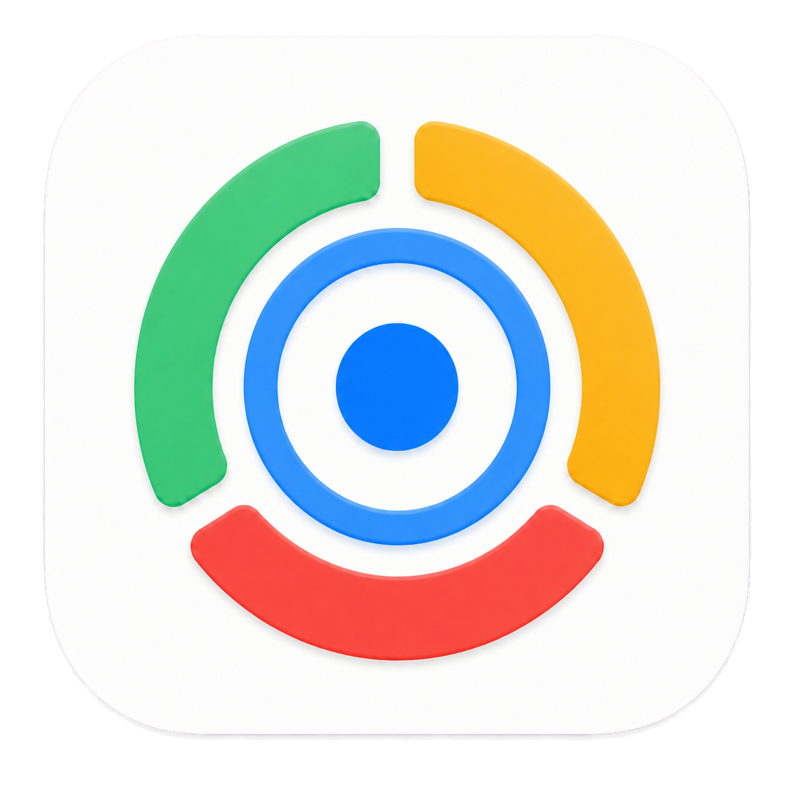
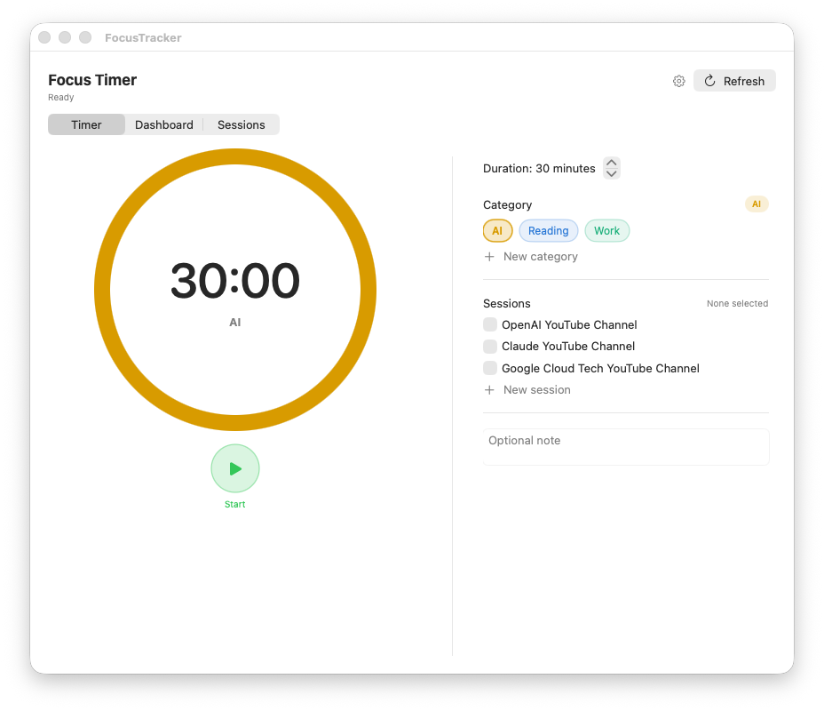
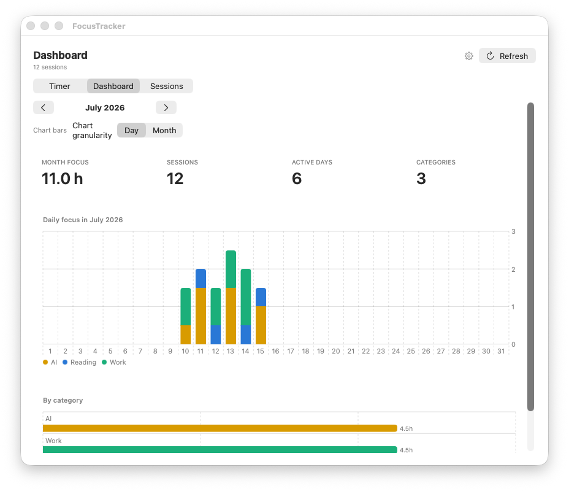

<p align="center">
  
</p>

<h1 align="center">FocusTracker</h1>

<p align="center">
  A native macOS focus timer, session log, and visual dashboard.<br>
  Keep everything locally or connect your own remote database.
</p>

<p align="center">
  
  
  
</p>

## See it in action

### Start a focused session

Choose a duration, category, one or more session names, and an optional note. The
menu-bar countdown stays available while you work.



### Understand where your time went

Review monthly totals, active days, category distribution, and day- or
month-granularity charts.



## What you can do

- Run a Clock-style timer with Start, Pause, Resume, Restart, and Cancel controls.
- Start sessions from the window or directly from the macOS menu bar.
- Organize work with reusable categories and category-linked session names.
- Add an optional note to capture context for each completed session.
- Browse sessions by exact date and add, edit, or delete entries.
- Compare daily or monthly focus time with category-colored charts.
- Store sessions entirely on your Mac or use your own remote REST database.
- Keep the app in the Dock and Command-Tab while retaining menu-bar controls.

## Quick start

### Requirements

- macOS 13 Ventura or newer
- Xcode Command Line Tools with Swift 5.9 or newer

### Clone and run

```bash
git clone https://github.com/brbousnguar/focus-tracker.git
cd focus-tracker/macos
swift run
```

FocusTracker opens on the Timer screen and also adds its compact ring icon to the
menu bar.

### Create your first session

1. Click the gear and keep **Local storage** selected—no account or token is needed.
2. Open **Sessions**, choose **Add session**, then create a category and session name.
3. Return to **Timer**, choose those values, and press **Start**.

The default duration is 30 minutes. For a manually added session, enter its finish
time and duration; FocusTracker calculates the start time automatically.

## Storage options

Open the gear in the app window to switch storage backends.

### Local storage

Local mode is the simplest and is the default for a new installation. Sessions
stay on the current Mac in:

```text
~/Library/Application Support/FocusTracker/local-sessions.json
```

Local sessions support the complete workflow: timer saves, charts, category and
session suggestions, plus add/edit/delete operations.

### Remote database

The current remote client uses the Supabase/PostgREST request format. To use it:

1. Create a Supabase project.
2. Run [`schema.sql`](schema.sql) in the Supabase SQL Editor.
3. In FocusTracker Settings, choose **Firebase**, then enter:
   - URL: `https://YOUR_PROJECT.supabase.co/rest/v1/sessions`
   - API key: your Supabase publishable/anon key
4. Save. The Dashboard and menu categories reload automatically.

The API-key field is masked. Press and hold the eye to reveal it; releasing the
eye hides it immediately. FocusTracker stores the URL and key only in the local
configuration file and never commits them to this repository.

> [!IMPORTANT]
> Local and remote sessions are separate collections. Switching backends does
> not copy or synchronize existing sessions.

## Daily workflow

### Timer

- Set the duration in five-minute increments.
- Pick one category and any number of related session names.
- Add a note when the occurrence needs extra context.
- Pause or resume without losing the current countdown.
- Stop early and save, or cancel and discard the session.

### Dashboard

- Move between months with the arrow controls.
- Review total hours, session count, active days, and categories.
- Switch chart bars between **Day** and **Month**.
- Category colors remain consistent across charts, badges, and pickers; AI is yellow.

### Sessions

- Choose an exact calendar date.
- Add a session using only finish time and duration.
- Edit start/end time, category, session names, note, or device.
- Delete incorrect entries.
- Quickly create missing categories or session names inside the editor.

### Menu bar

The menu overlay provides native macOS shortcuts for Timer, Dashboard, Sessions,
category-based starts, active timer controls, refresh, Settings, and Quit.

## Configuration and data

FocusTracker keeps runtime files outside the repository:

```text
~/Library/Application Support/FocusTracker/
├── config.json          # storage choice, URL/key, device, default duration
├── local-sessions.json  # editable local session collection
├── sessions.jsonl       # append-only safety log
└── outbox.json          # remote retry queue
```

These files, environment files, credentials, build products, and packaged apps
are excluded by [`.gitignore`](.gitignore).

## Build from source

```bash
cd macos
swift build -c release
```

The release executable is written to `macos/.build/release/FocusTracker`. For the
packaged `.app` layout and icon compilation details, see
[`macos/README.md`](macos/README.md).

## Project structure

```text
focus-tracker/
├── docs/images/              # privacy-safe demo screenshots
├── macos/
│   ├── Resources/            # app icon and asset catalog
│   ├── Sources/FocusTracker/ # AppKit + SwiftUI application source
│   └── Package.swift
├── schema.sql                # optional Supabase schema and RLS policies
└── LICENSE                   # permissive MIT license
```

## Security notes

- Never commit your real database URL and API key together.
- Treat `config.json`, local session files, and outbox data as private.
- Review the policies in `schema.sql` before using the database for multiple users.
- The public repository contains placeholders only—no production endpoint, key,
  personal session data, or signed application bundle.

## Contributing

Issues and pull requests are welcome. Before opening a PR:

```bash
cd macos
swift build -c release
```

Please keep credentials and personal session data out of commits and screenshots.

## License

FocusTracker is available under the [MIT License](LICENSE). You may use, copy,
modify, distribute, sublicense, or sell copies of the project as long as the
copyright and license notice are retained.
